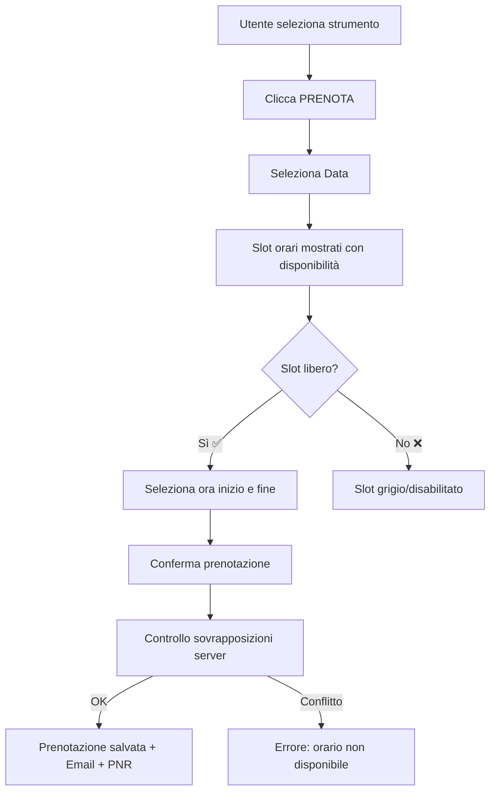

# 🔬 UniScan — Lab & Stock Management

**UniScan** è un'applicazione web single-page per la gestione del laboratorio di bioinformatica dell'Università Magna Graecia di Catanzaro. Permette di gestire strumenti, prenotazioni e inventario in un'unica interfaccia moderna e reattiva.

> 🌐 **Live Demo:** [bioinformaticslab-unicz.github.io/lab-management](https://bioinformaticslab-unicz.github.io/lab-management/)

---

## ✨ Funzionalità Principali

### 📦 Magazzino (Inventario)
- Gestione completa dell'inventario con nome, marca, categoria, quantità, soglia minima
- **Allerta scorte basse** automatiche con notifica visiva
- Scansione **QR Code** per accesso rapido agli articoli
- Import/Export **CSV** per backup e migrazione dati
- Email automatica di riordino quando un articolo scende sotto soglia

### 📅 Prenotazioni Strumenti
- Prenotazione strumenti con selezione data e **slot orari a 30 minuti** (05:00 – 21:00)
- **Prevenzione automatica sovrapposizioni**: gli slot già occupati appaiono in grigio e non sono selezionabili
- Codice **PNR** univoco per ogni prenotazione
- **Email di conferma** con link a Google Calendar
- Ricerca prenotazione tramite PNR

### 🛡️ Pannello Amministratore
- Accesso basato su **email** (niente PIN)
- Gestione completa strumenti: aggiungi, modifica, elimina
- **Vista calendario** per ogni strumento con badge "IN USO"
- Creazione e modifica prenotazioni per conto degli utenti
- Export prenotazioni in CSV
- Stampa etichette QR per tutti gli strumenti
- Gestione lista amministratori via Firestore
- Modalità manutenzione attivabile

### 📺 Totem Dashboard
- Dashboard a schermo intero per monitor in laboratorio
- Visualizzazione in tempo reale di:
  - **Attività in corso** (strumento + utente)
  - **Prossime prenotazioni** (strumento, utente, data e orario)
  - **Allerta scorte basse** con ticker scorrevole
- Orologio in tempo reale

---

## 🏗️ Architettura

L'app è un **singolo file HTML** (`index.html`) che include tutto il necessario:

| Componente | Tecnologia |
|---|---|
| **Frontend** | HTML5, Tailwind CSS (CDN), Vanilla JS |
| **Backend/DB** | Firebase Firestore (real-time) |
| **Autenticazione** | Firebase Auth (Email/Password + Google) |
| **Email** | EmailJS (conferma prenotazioni, alert riordino) |
| **QR Code** | html5-qrcode (scanner), goqr.me API (generatore) |
| **Icone** | Lucide Icons |
| **Hosting** | GitHub Pages |

### Struttura Firestore
```
artifacts/{appId}/public/data/
├── bookings/          # Prenotazioni
├── inventory/         # Articoli magazzino
├── instruments/       # Strumenti del laboratorio
└── settings/
    ├── global         # Modalità manutenzione, referente
    └── admins         # Lista email amministratori
```

---

## 🚀 Configurazione

### 1. Firebase
1. Crea un progetto su [Firebase Console](https://console.firebase.google.com/)
2. Abilita **Authentication** (Email/Password + Google)
3. Crea un database **Firestore**
4. Copia la configurazione Firebase nel file `index.html` nella sezione `firebaseConfig`

### 2. EmailJS (opzionale)
1. Registrati su [EmailJS](https://www.emailjs.com/)
2. Crea un servizio e due template:
   - `template_6nayepk` — Alert riordino scorte
   - `template_hvc2lnt` — Conferma prenotazione
3. Aggiorna le costanti `EMAILJS_SERVICE_ID`, `EMAILJS_PUBLIC_KEY`, e i template ID nel file

### 3. Deploy
```bash
git clone https://github.com/bioinformaticslab-unicz/lab-management.git
# Modifica firebaseConfig e credenziali EmailJS in index.html
git add . && git commit -m "config" && git push
```
L'app sarà disponibile su GitHub Pages automaticamente.

---

## 📱 Modalità di Accesso

| URL | Funzione |
|---|---|
| `/` | Interfaccia principale (login richiesto) |
| `/?totem=true` | Dashboard Totem a schermo intero |
| `/?r=STRUMENTO_ID` | Accesso diretto a uno strumento (da QR) |

---

## 👤 Ruoli

| Ruolo | Accesso |
|---|---|
| **Utente** | Login, prenotazioni proprie, ricerca PNR, scansione QR |
| **Amministratore** | Tutto il sopra + gestione strumenti, inventario, prenotazioni, impostazioni |

Gli amministratori sono definiti tramite:
- Email di default hardcoded (`vono.niccolo@gmail.com`)
- Lista dinamica in Firestore (`settings/admins`)

---

## 📋 Flusso Prenotazione



## 📦 Flusso Magazzino

```mermaid
graph TD
    A[Scansione QR Articolo] --> B{Esiste?}
    B -->|Sì| C[Visualizza Dettagli & Quantità]
    B -->|No| D[Admin: Crea nuovo articolo?]
    C --> E[Seleziona Azione]
    E --> F[Preleva (-)]
    E --> G[Rifornisci (+)]
    F --> H[Aggiorna Quantità]
    G --> H
    H --> I[Check Soglia Minima]
    I -->|Sotto Soglia| J[Email Alert Riordino 📩]
    I -->|Sopra Soglia| K[OK]
```

---

## 🛠️ Sviluppo

L'app è interamente contenuta in `index.html`. Per sviluppare localmente:

```bash
# Servire con qualsiasi HTTP server
python3 -m http.server 8000
# oppure
npx serve .
```

> ⚠️ Il login Google richiede che il dominio sia autorizzato nella console Firebase (es. `localhost`, `bioinformaticslab-unicz.github.io`).

---

## 📄 Licenza

Progetto del Laboratorio di Bioinformatica — Università Magna Graecia di Catanzaro.
