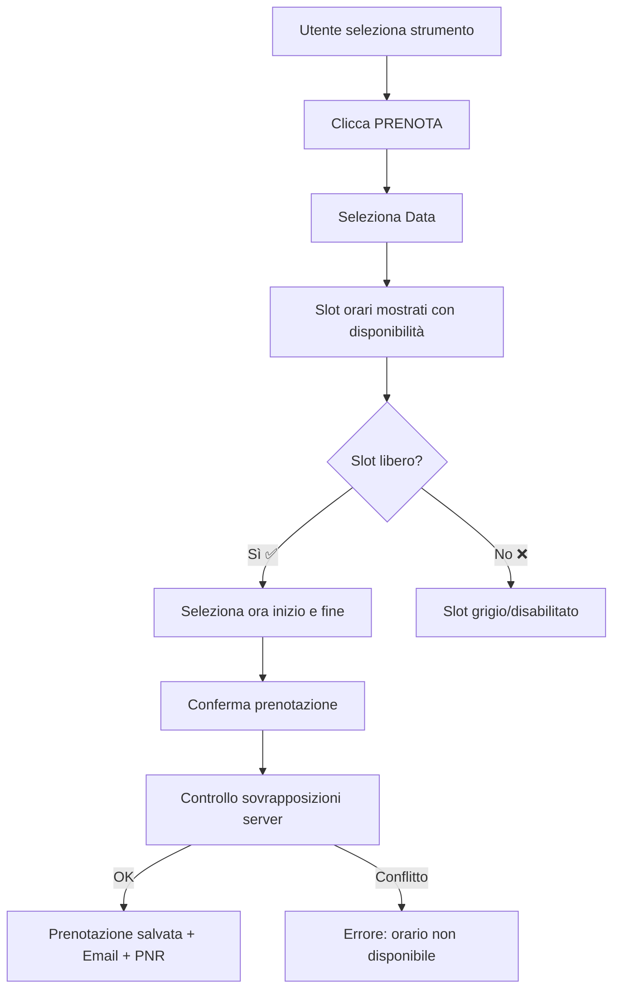
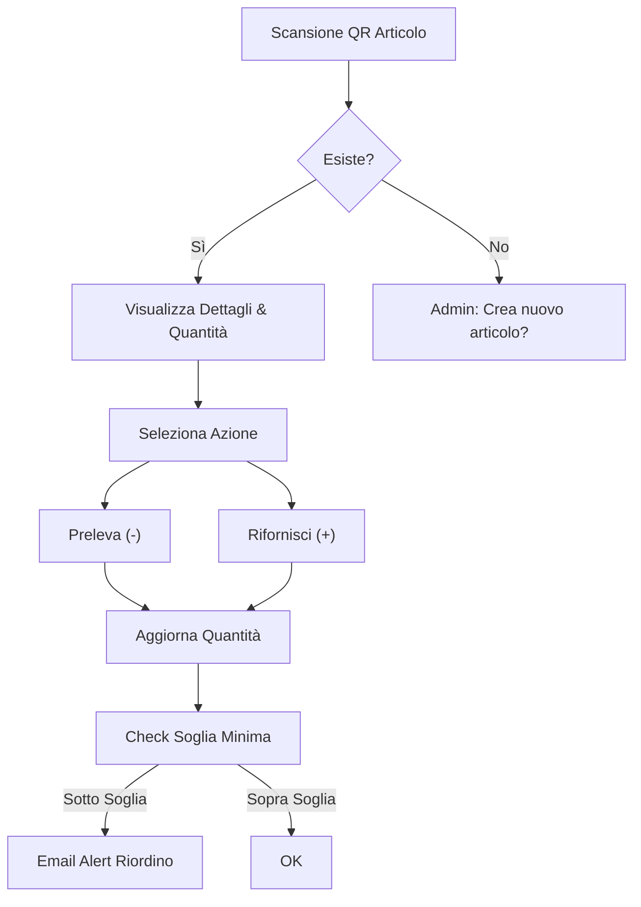

# 🔬 UniScan — Lab & Stock Management

**UniScan** è un'applicazione web single-page per la gestione del laboratorio di bioinformatica dell'Università Magna Graecia di Catanzaro. Permette di gestire strumenti, prenotazioni e inventario in un'unica interfaccia moderna e reattiva.

> 🌐 **Live Demo:** [bioinformaticslab-unicz.github.io/lab-management](https://bioinformaticslab-unicz.github.io/lab-management/)

---

## ✨ Funzionalità Principali

### 📦 Magazzino (Inventario)
- Gestione completa dell'inventario con nome, marca, categoria, quantità, soglia minima
- **Filtri dinamici**: ricerca avanzata per Marchio, Categoria e Posizione
- **Capacità/Formato**: specifica volume o peso per singolo pezzo (es. 500 ml, 1 kg)
- **Allerta scorte basse** automatiche con notifica visiva
- Scansione **QR Code / Barcode** per accesso rapido agli articoli
- **Supporto Excel (XLSX)**: Import/Export nativo e download Template dinamico
- **Unità personalizzate**: creazione di nuove unità di misura direttamente dal form
- Email automatica di riordino quando un articolo scende sotto soglia
- **Foto prodotto** con URL immagine, visibile nella scheda e nei risultati di ricerca
- **Operazioni batch (Carrello)**: modalità carico multiplo attivabile dall'admin, con scansione continua e riepilogo carrello
- **Eliminazione multipla**: cancellazione massiva di articoli dal magazzino tramite selezione (solo admin)

### 📅 Prenotazioni Strumenti
- Prenotazione strumenti con selezione data e **slot orari a 30 minuti** (05:00 – 21:00)
- **Prenotazioni multi-giorno**: supporto Data Inizio e Data Fine separati
- **Prevenzione automatica sovrapposizioni**: gli slot già occupati appaiono in grigio e non sono selezionabili
- Codice **PNR** univoco per ogni prenotazione
- **Email di conferma** con link a Google Calendar
- Ricerca prenotazione tramite **PNR o Email** con visualizzazione multipla risultati

### 🛡️ Pannello Amministratore
- Accesso basato su **email** con sistema **RBAC a 4 livelli** (Main Admin, Co-Admin, Supervisor, Utente)
- **Permessi Moduli Granulari**: abilita/disabilita l'accesso a "Magazzino" o "Strumenti" per specifici utenti standard
- Gestione completa strumenti: aggiungi, modifica, elimina con **foto strumento**, **Restricted Mode** (visibilità solo admin) e **evidenziazione selezione**
- **Vista calendario** per ogni strumento con badge "IN USO"
- Creazione e modifica prenotazioni per conto degli utenti
- Export dati (Prenotazioni, Inventario, Log) in **CSV o XLSX**
- **Generatore Etichette**: stampa QR Code e/o Barcode (CODE128) per strumenti e articoli, con selezione multipla e finestra di stampa/esportazione PDF dedicata
- Gestione lista amministratori e supervisori via Firestore
- **Permessi granulari** per Supervisori (Prenotazioni, Magazzino, Strumenti, Log)
- Modalità manutenzione attivabile
- **Modalità Desktop**: ottimizzazione per PC con lettore barcode fisico, navigazione da tastiera e auto-focus
- **Sicurezza aggiuntiva**: timeout automatico della sessione dopo 5 minuti di inattività

### 📺 Totem Dashboard
- Dashboard a schermo intero per monitor in laboratorio
- Visualizzazione in tempo reale di:
  - **Attività in corso** (strumento + utente)
  - **Prossime prenotazioni** (strumento, utente, data e orario)
  - **Allerta scorte basse** con ticker scorrevole
- Orologio in tempo reale

---

## 🏗️ Architettura

L'app è un **singolo file HTML** (`index.html`) che include tutto il necessario:

| Componente | Tecnologia |
|---|---|
| **Frontend** | HTML5, Tailwind CSS (CDN), Vanilla JS |
| **Backend/DB** | Firebase Firestore (real-time) |
| **Autenticazione** | Firebase Auth (Email/Password + Google) |
| **Email** | EmailJS (conferma prenotazioni, alert riordino) |
| **QR Code** | html5-qrcode (scanner), QR Server API (generatore) |
| **Barcode** | JsBarcode (CODE128, generatore etichette) |
| **Icone** | Lucide Icons |
| **Grafici** | Chart.js |
| **Excel** | SheetJS (xlsx) |
| **Barcode** | JsBarcode |
| **Hosting** | GitHub Pages |

### Struttura Firestore
```
artifacts/{appId}/public/data/
├── bookings/          # Prenotazioni
├── inventory/         # Articoli magazzino
├── resources/         # Strumenti del laboratorio
└── settings/
    ├── global         # Manutenzione, referente, batch mode
    ├── admins         # Lista email co-amministratori
    └── supervisors    # Supervisori con permessi granulari
```

---

## 🚀 Configurazione

### 1. Firebase
1. Crea un progetto su [Firebase Console](https://console.firebase.google.com/)
2. Abilita **Authentication** (Email/Password + Google)
3. Crea un database **Firestore**
4. Copia la configurazione Firebase nel file `index.html` nella sezione `firebaseConfig`

### 2. EmailJS (opzionale)
1. Registrati su [EmailJS](https://www.emailjs.com/)
2. Crea un servizio e due template:
   - `template_6nayepk` — Alert riordino scorte
   - `template_hvc2lnt` — Conferma prenotazione
3. Aggiorna le costanti `EMAILJS_SERVICE_ID`, `EMAILJS_PUBLIC_KEY`, e i template ID nel file

### 3. Deploy
```bash
git clone https://github.com/bioinformaticslab-unicz/lab-management.git
# Modifica firebaseConfig e credenziali EmailJS in index.html
git add . && git commit -m "config" && git push
```
L'app sarà disponibile su GitHub Pages automaticamente.

---

## 📱 Modalità di Accesso

| URL | Funzione |
|---|---|
| `/` | Interfaccia principale (login richiesto) |
| `/?totem=true` | Dashboard Totem a schermo intero |
| `/?r=STRUMENTO_ID` | Accesso diretto a uno strumento (da QR) |

---

## 👤 Ruoli (RBAC a 4 livelli)

| Ruolo | Accesso |
|---|---|
| **Utente** | Login (solo domini `@unicz.it` / `@studenti.unicz.it`), prenotazioni proprie, ricerca PNR/email, scansione QR |
| **Supervisor** | Tutto il sopra + accesso selettivo a Prenotazioni, Magazzino, Strumenti, Log (configurabile dall'Admin) |
| **Co-Admin** | Tutto il sopra + gestione supervisori, impostazioni |
| **Main Admin** | Tutto il sopra + gestione co-admin (hardcoded: `vono.niccolo@gmail.com`) |

- **Main Admin**: hardcoded nel codice
- **Co-Admin**: gestiti via Firestore (`settings/admins`)
- **Supervisori**: gestiti via Firestore (`settings/supervisors`) con permessi granulari via checkbox

---

## 📋 Flusso Prenotazione


```mermaid
graph TD
    A["Utente seleziona strumento"] --> B["Clicca PRENOTA"]
    B --> C["Seleziona Data"]
    C --> D["Slot orari mostrati con disponibilità"]
    D --> E{"Slot libero?"}
    E -->|Sì ✅| F["Seleziona ora inizio e fine"]
    E -->|No ❌| G["Slot grigio/disabilitato"]
    F --> H["Conferma prenotazione"]
    H --> I["Controllo sovrapposizioni server"]
    I -->|OK| J["Prenotazione salvata + Email + PNR"]
    I -->|Conflitto| K["Errore: orario non disponibile"]
```

## 📦 Flusso Magazzino


```mermaid
graph TD
    A["Scansione QR Articolo"] --> B{"Esiste?"}
    B -->|Sì| C["Visualizza Dettagli & Quantità"]
    B -->|No| D["Admin: Crea nuovo articolo?"]
    C --> E["Seleziona Azione"]
    E --> F["Preleva (-)"]
    E --> G["Rifornisci (+)"]
    F --> H["Aggiorna Quantità"]
    G --> H
    H --> I["Check Soglia Minima"]
    I -->|Sotto Soglia| J["Email Alert Riordino"]
    I -->|Sopra Soglia| K["OK"]
```

---

## 🛠️ Sviluppo

L'app è interamente contenuta in `index.html`. Per sviluppare localmente:

```bash
# Servire con qualsiasi HTTP server
python3 -m http.server 8000
# oppure
npx serve .
```

> ⚠️ Il login Google richiede che il dominio sia autorizzato nella console Firebase (es. `localhost`, `bioinformaticslab-unicz.github.io`).

---

## 🚀 Prossime Funzionalità (Roadmap)

- 📊 **Infografiche Avanzate**: Visualizzazione dinamica del consumo dei prodotti e dei tassi di utilizzo degli strumenti tramite grafici interattivi (Chart.js) per analizzare le tendenze nel tempo.
- 🔔 **Sistema di Allerta Dashboard**: Notifiche in tempo reale e avvisi visivi sulla Dashboard Totem per segnalare modifiche critiche, note urgenti o guasti agli strumenti.
- 📅 **Gestione Scadenze (Expiry Dates)**: Tracciamento automatico delle date di scadenza per reagenti e materiali deperibili con avvisi di pre-scadenza.
- 🛠️ **Manutenzione Programmata**: Modulo per la gestione dei cicli di manutenzione e calibrazione degli strumenti con registro storico degli interventi.
- 📑 **Audit Log Avanzato**: Registro dettagliato delle attività per operatore per una tracciabilità completa di ogni prelievo o modifica all'inventario.

---

## 📄 Licenza

Progetto del Laboratorio di Bioinformatica — Università Magna Graecia di Catanzaro.
